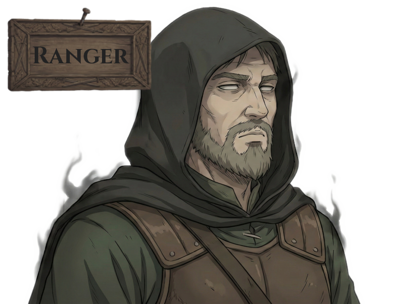
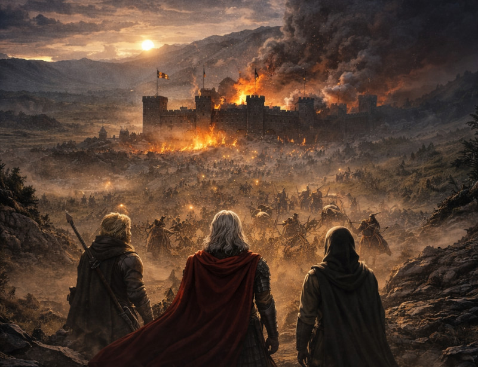

# sldshow2

High-performance slideshow image viewer with custom [WGSL](https://www.w3.org/TR/WGSL/) transitions, built with Rust, [winit](https://github.com/rust-windowing/winit), [wgpu](https://github.com/gfx-rs/wgpu), and [egui](https://github.com/emilk/egui).

## Features

- **Rich transition effects** — crossfade, roll, blind, box, angular wipe, random squares, and more
- **HDR / EXR support** *(beta)* — native Rgba16Float pipeline on HDR displays; EXR sequence playback with auto-detected FPS
- **Interactive zoom & pan** — Ctrl+scroll to zoom, drag to pan
- **Color adjustments** — contrast, brightness, gamma, saturation
- **Gallery view** — thumbnail grid with scrub bar and on-screen controller
- **Settings panel** — runtime controls for playback, transitions, display, and window
- **AmbientFit** — blurred background fill instead of black bars
- **Screenshot & clipboard** — capture frame to PNG, copy image or path
- **Drag & drop** — drop files/folders to load; Shift+drop to append
- **Transparent & frameless windows**, hot-reload config, screen saver prevention (Windows)

## Quick Start

```bash
cargo run --example generate_test_images
cargo run --release -- test.sldshow
```

Press `?` in-app for the full keyboard shortcut reference.

## Configuration

TOML files with `.sldshow` extension. Lookup: CLI arg → `~/.sldshow` → defaults.

See [`example.sldshow`](example.sldshow) for all options — window, viewer (playback mode, fit mode, texture limits, scan subfolders, …), transition, and style (background, font, transparency).

## Supported Formats

PNG, JPEG, GIF, BMP, TIFF, WebP, ICO, TGA, HDR, PNM, DDS, AVIF, OpenEXR

## Development

- [CONTRIBUTING.md](CONTRIBUTING.md) — setup, workflow, coding standards
- [docs/ARCHITECTURE.md](docs/ARCHITECTURE.md) — module map and key flows
- [AGENTS.md](AGENTS.md) — AI agent automation (`agent:ready` issues)

## License

MIT — Based on the original [sldshow](https://github.com/ugai/sldshow) by ugai. Transitions adapted from [GL Transitions](https://gl-transitions.com/) (MIT).

## Appendix

### The Guild — Agent Teams

*The following is lore.*

Three agents serve the Guild.
Issues labeled `agent:ready` are autonomously implemented and delivered as pull requests.

#### Agents (Skills)

<table>
<tr>
<td align="center" width="33%">
<br>
<strong><code>issue-ranger</code></strong> — <em>No Unknown Unknowns.</em><br>
Ranges far. Crawls deep. Every wound in the codebase — named, scoped, filed.
Nothing escapes the board.
</td>
<td align="center" width="33%">
<br>
<strong><code>issue-slayer</code></strong> — <em>The Blade, The Lone Wolf.</em><br>
The <code>agent:ready</code> label is the contract. The worktree is where it dies. The PR is the proof.
Does not theorize. Does not over-engineer. No issue survives.
</td>
<td align="center" width="33%">
<br>
<strong><code>issue-raid-commander</code></strong> — <em>Forged by Sprints, Not Blade.</em><br>
Reads the ready queue. Spots every conflict before it forms. Charts the sprint plan.
Once fought on the front lines. Now stands behind them.
</td>
</tr>
</table>

#### Workflow

<div align="center">
<br><br>
<strong><code>dispatching-guild-expedition</code></strong> — <em>One Command. Full Sprint.</em><br>
Orchestrates the entire pipeline: Rangers × N scout in parallel, the user
approves issues at the gate, Raid Commander maps the battlefield, then
Slayers × N charge in parallel.
From empty board to open PRs. The whole Guild, at once. Conquered.
</div>
